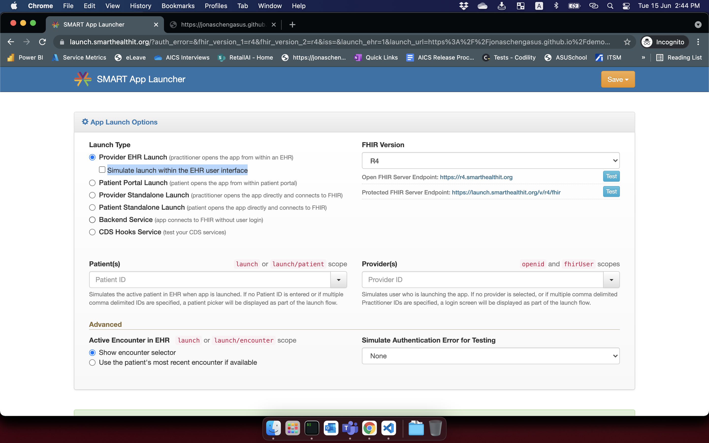

This demo code is implemented base upon sandbox [smarthealthit](https://launch.smarthealthit.org/?auth_error=&fhir_version_1=r4&fhir_version_2=r4&iss=&launch_ehr=1&launch_url=https%3A%2F%2Fepic-2.jonascheng1.repl.co%2Flaunch.html&patient=aa0b29d0-6916-4fb7-85f0-6e42370dd5fa&prov_skip_auth=1&prov_skip_login=1&provider=e443ac58-8ece-4385-8d55-775c1b8f3a37&pt_skip_auth=1&public_key=&sb=&sde=&select_encounter=1&sim_ehr=0&token_lifetime=15&user_pt=)

You may follow the instructions on the web site to test out.
1. Choose `Provider EHR Launch`
2. Uncheck `Simulate launch within the EHR user interface`
3. Choose `FHIR Version`
4. Check `Show encounter selector`
5. Specify `App Launch URL`

The app recursively retrieves resources `DocumentReference`, `Condition`, and `Procedure` from all patients.
